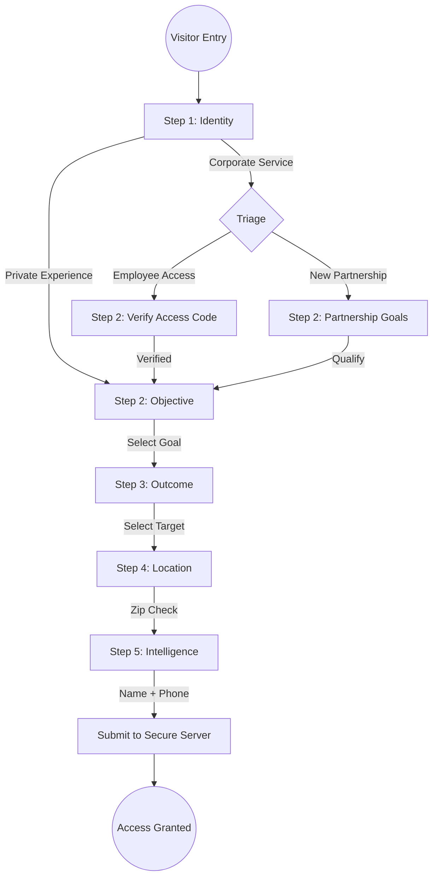

# Axis OS: User Flow Architecture

## 1. The Membership Application Protocol (Overview)
The application uses a **60-Second Membership** strategy designed for mobile-first, zero-friction intake. It eliminates traditional forms in favor of tactical decision buttons.

## 2. Decision Logic & Intelligence

### Step 1: Identity (Triage)
- **Private**: Direct path to personalized performance discovery.
- **Corporate**: Splits into two distinct streams:
    - **Corporate New**: Asks for partnership objectives (Onsite demos, Executive strategy) and headcount.
    - **Employee Access**: Requires a secure access code before proceeding.

### Step 2 & 3: Objective & Outcome
- **Strategy**: 100% button-driven. Captures high-signal clinical intent without requiring the user to type.
- **"Other" Path**: Opens a minimal text input only if specific categories don't match.

### Step 4: Location Intelligence
- **Private Path**: Checks input against a dynamic whitelist (e.g., 84010, 84011).
- **Corporate Path**: Applies a "Wasatch Front Heatmap" logic (Zip Prefixes 840, 841, 843, 844) to estimate a 60-mile radius.
- **Result**:
    - **In-Zone**: Direct path to priority contact.
    - **Extended**: Warns user of potential logistics delay before proceeding.

### Step 5: Intelligence (Contact)
- **Minimalism**: Captures ONLY Full Name and Phone. 
- **Promise**: Email and full medical onboarding are deferred to the Jane App following concierge contact.

## 3. Data Flow
1. **Frontend**: Captures selections and flags (e.g., `isOutOfRange`).
2. **Server Action**: Validates data, calculates server-side "Out of Area" status for security.
3. **Supabase**: Saves to `leads` table as a `New` status lead.
4. **Admin**: Lead appears in the "Waiting Room" (Admin Dashboard) for Dr. Hanson to triage.
